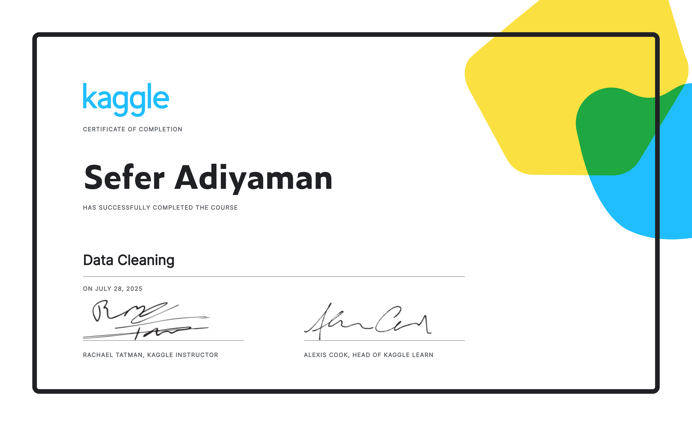

# 🧹 Kaggle Data Cleaning (Course Completion)

This repository contains my completed work from the **[Kaggle Data Cleaning course](https://www.kaggle.com/learn/data-cleaning)**.  
The course focuses on essential data cleaning skills in Python, using pandas.

---

## 📁 Repository Structure

notebook/     # My final Jupyter Notebook with all course exercises  
data/         # Any raw or cleaned datasets used  
output/       # Optional output files (e.g. CSVs, visualizations)  
certificate/  # Completion certificate (PNG)  

---

## 📓 Notebook

👉 **[View the final notebook](notebook/Data-Cleaning_Kaggle_Course.ipynb)** with all exercises and explanations.

## 🏅 Certificate of Completion

---

> ✅ Completed in July 2025.  
> 📚 Part of my journey to become a data analyst.

